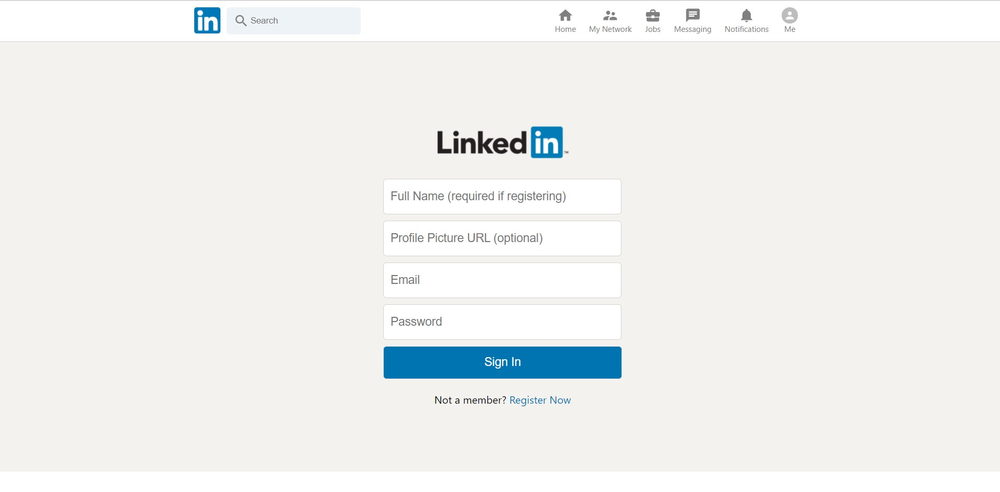
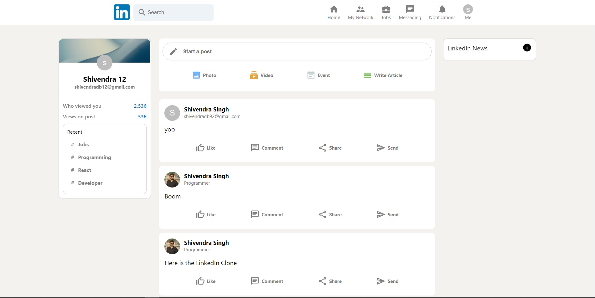

<h1 align="center">LinkedIn Clone</h1>
<h5 align="center">A cloned version of LinkedIn that you can find on the web</h5>

<br/>


<br/>

## 🎯 About

I have started this project with the purpose of learning how to structure a Web App of a mid-level complexity integrating the Redux logic. <br/>
I've tried to replicate the original layout as much as possible and I've also made some improvements in some sections inserting animations and micro-interactions.
I put a lot of effort into it and I hope that you could like it.<br/><br/>
The Web App lands you to an Authentication page, in which you can choose to sign up or to sign in: you can sign up with your custom account by filling the form and clicking the Register now button. Once you are logged in, you will land on the homepage, in which you can find the feeds.<br/>
You can add a feed by entering the details in the add feed component and press enter to publish the feed.<br/>
➡️ Go try it and please let me know if you enjoyed it with a ⭐️, I would appreciate it a lot.
<br/>
<br/>

## ▶️ Demo

Here you can find the demo link:

[https://linkedin-clone-6a462.web.app](https://linkedin-clone-6a462.web.app/)

### Test credentials

> Email: test.user@gmail.com<br/>
> Password: test.user<br/>

&nbsp; or, you can create your own credentials on the website. <br/>
&nbsp; - Input the required details on the Sign-In Page and click on the **Register Now** button.
<br/>

## ✨ Features

✔️: &nbsp;&nbsp;Display feeds, old and recently updated<br />
✔️: &nbsp;&nbsp;Add Feed functionality<br />
✔️: &nbsp;&nbsp;React-Flip-Move animation (credits: [joshwcomeau/react-flip-move](https://github.com/joshwcomeau/react-flip-move)) for the feed animation<br />
✔️: &nbsp;&nbsp;User Sign Up & User Sign In<br />
✔️: &nbsp;&nbsp;Use of React hooks<br />
✔️: &nbsp;&nbsp;Responsive layout<br />
✔️: &nbsp;&nbsp;Swipeable feed content<br />

## 🚀 Technologies

- [React](https://reactjs.org/)
- [React Hooks](https://reactjs.org/docs/hooks-intro.html)
- [Redux](https://redux.js.org/)
- [Firebase](https://firebase.google.com/)
- [Material-UI Icons](https://material-ui.com/)
- [React-Flip-Move](http://joshwcomeau.github.io/react-flip-move/examples/#/?_k=hm48zl)
  <br/>

# 📸 Screenshots

## Sign-In Page


<br/>

## Home Page



<br/>

## ✅ Requirements

Before starting you need to have [Git](https://git-scm.com) and [Node](https://nodejs.org/en/) installed.

<br/>

## 🔗 Run Locally

- Clone the project

```bash
  git clone https://github.com/shivendradb/LinkedIn-clone.git
```

- Go to the project directory

```bash
  cd LinkedIn-clone
```

- Install dependencies

```bash
  npm install
```

- Start the server

```bash
  npm start
```

Note: <br/>
The page will reload if you make edits. <br/>
You will also see any lint errors in the console.

<br/>

# To Deploy your own Backend services for this project

## Firebase Configuration and Deploy

[](https://console.firebase.google.com/)

### ⚙️ **Configuration steps** :

1. Search for Firebase console, Go and connect your Google account to Firebase console.
2. Create the project (name it as you want).
3. In Project → Go to Add app → Set Name (again as per you wish) and **check** the **Hosting service** and click next button, for the other steps till it comes back to the console.
4. Go back to the project section, and click on the project setting from the left navgation bar. Navigate down the page, Under the **SDK setup and configuration** click on Config. Copy the whole firebaseConfig and paste in the **firebase.js** file under the project folder.
5. **For Authentication** : From the left navigation bar, go to the Authentication → Sign-in-method → Click **Email/Password** and **Enable** it.
6. **For Database** : From the left navigation bar, go to Firestore Database → Start Collection → Set **posts** as Collection ID and click next and that's it.
7. In the project, run the command **"npm run build"** for a production ready build. <br/>
   This command will automatically create a production ready web app for you and remove all the unwanted dependencies, images, and bunch of stuff.

### 🌐 **Deploy steps** :

1. Install Firebase tools in your project using **"npm install -g firebase-tools"** command. Now, run **"firebase login"** command and login using your firebase account.
2. Now run the **"firebase init hosting"** command then, existing project -> select your project. Make sure to have the following after this command: <br/>
   &nbsp;&nbsp; Your public folder: **build** <br/>
   &nbsp;&nbsp; Configure as a single-page app: **Yes** <br/>
   &nbsp;&nbsp; Link with GitHub account: **No**
3. Here, after all the hardwork, you are all set to deploy the application. Run **"firebase deploy"** command to deploy the app.
   <br/>
   <br/>

🥳🥳 Yayy!! You are done with deployment part. <br/>
You will be provided with the link, clck the link and share with others. <br/>

You can **contact me** in case of any issues or discrepancies. <br/>

#### **Please let me know if you enjoyed it with a ⭐️, I would appreciate it a lot.**
